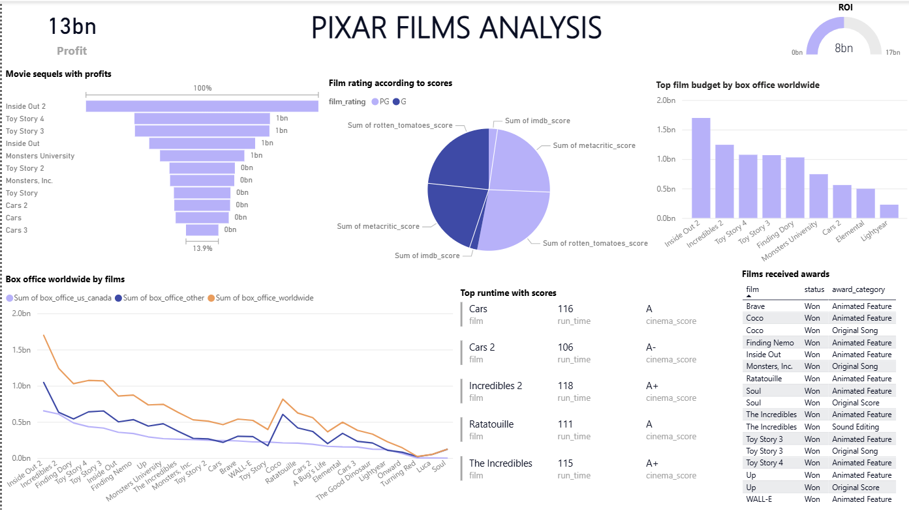
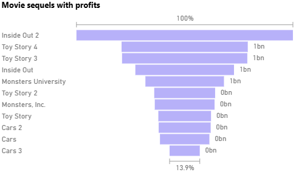
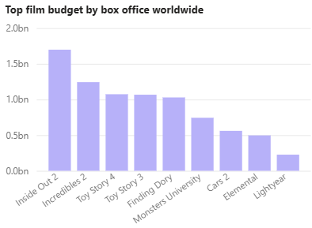
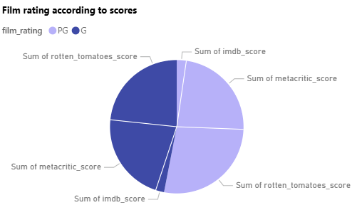
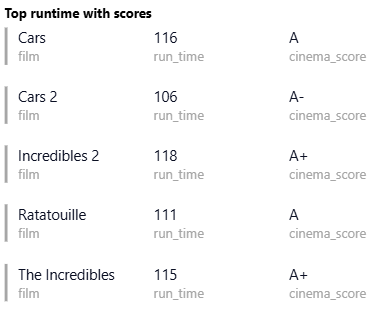
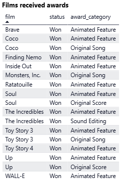
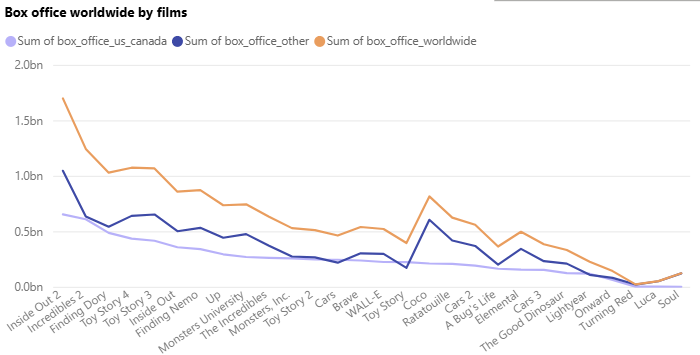

# 🎬 Pixar Films Analysis 

**Entertainment Analytics | Power BI Dashboard | Maven Analytics Challenge**

---

## Project Background
Pixar Animation Studios is a leading animation film studio operating in the entertainment industry since the mid‑1990s. Known for combining storytelling with cutting‑edge animation, Pixar follows a high‑investment, high‑return business model where films are produced with substantial budgets and monetized primarily through global box office revenue, followed by merchandising and licensing.

From the perspective of a data analyst conducting an external analytical project, the goal of this analysis is to evaluate how Pixar’s creative decisions (originals vs. sequels, themes, genres) and financial investments translate into commercial success, critical reception, and awards recognition over time. Key business metrics analyzed include production budget, box office revenue, profitability, critic ratings, and awards.

Insights and recommendations are provided across the following key areas:
* **Category 1:** Profitability & Sequels Performance
* **Category 2:** Budget vs Box Office Performance
* **Category 3:** Ratings & Scores Distribution
* **Category 4:** Runtime, Awards & Box Office Trends

The cleaned dataset and transformation logic are embedded within the Power BI model.An interactive Power BI dashboard used to explore Pixar’s performance trends is included in this repository.

---

## Data Structure & Initial Checks
The dataset consists of a single primary table containing **28 Pixar films released between 1995 and 2024**, with a total of **22 attributes**. Each row represents one Pixar film.

### Table: Pixar_Films
Key fields include:
* Film Title
* Release Year
* Genre
* Original / Sequel Flag
* Production Budget
* Box Office Revenue
* Profitability Metrics
* IMDb / Critic Ratings
* Awards & Nominations

### Initial Data Checks
* Verified correct data types (budgets and revenues as numeric, ratings as decimals)
* Checked for missing or null values.
* Validated year ranges and consistency across financial and rating fields

---

## Executive Summary

### Overview of Findings
From the dashboard, it is observed that Pixar’s total profit across films is approximately $13bn, with sequels contributing the largest share of profitability. High box office revenue does not consistently align with the highest production budgets, and awards recognition spans across both commercially successful and moderately performing films.

---

## Insights Deep Dive

### Category 1: Profitability & Sequels Performance
* **Insight 1:** From the Movie sequels with profits bar chart, Inside Out 2 appears as the highest-profit sequel, followed by Toy Story 4 and Toy Story 3.
* **Insight 2:** Multiple films from the Toy Story franchise appear repeatedly among profitable titles, indicating consistent financial performance across sequels.
* **Insight 3:** Several earlier films (e.g., Cars, Monsters, Inc.) show comparatively lower profit values relative to recent releases.
* **Insight 4:** The dashboard headline KPI shows total profit of ~13bn, indicating strong cumulative financial performance.

---

### Category 2: Budget vs Box Office Performance
* **Insight 1:** From the Top film budget by box office worldwide chart, Inside Out 2 leads worldwide box office among the listed films.
* **Insight 2:** Films such as Toy Story 4 and Toy Story 3 achieve high box office results without being the highest-budget films.
* **Insight 3:** Higher budgets do not consistently result in proportionally higher box office revenue.
* **Insight 4:** Mid-budget films such as Monsters University still achieve strong worldwide box office outcomes.

---

### Category 3: Ratings & Scores Distribution
* **Insight 1:** From the Film rating according to scores pie chart, Rotten Tomatoes scores contribute the largest share among the aggregated rating metrics.
* **Insight 2:** IMDb and Metacritic scores contribute smaller but comparable proportions.
* **Insight 3:** The distribution indicates relatively balanced critical reception across multiple rating platforms.
* **Insight 4:** No single rating source overwhelmingly dominates all others.

---

### Category 4: Runtime, Awards & Box Office Trends
* **Insight 1:** From the Top runtime with scores table, Incredibles 2 has the longest runtime (118 minutes) among the highlighted films.
* **Insight 2:** Films with longer runtimes (e.g., Cars, The Incredibles) still maintain strong cinema scores (A or A+).
* **Insight 3:** The Films received awards table shows multiple films winning Animated Feature, with some also winning Original Song or Sound Editing.
* **Insight 4:** The Box office worldwide by films line chart shows higher box office peaks for earlier and franchise films, followed by a gradual decline across later standalone titles.

---

## Recommendations
Based on the analysis, the following recommendations are proposed as hypothetical insights that could inform decision-making for studios with similar bus
* **Revenue Stability:** Continue leveraging sequels for predictable box office performance, especially during high‑investment cycles.
* **Creative Balance:** Maintain a steady pipeline of original films to support long‑term brand strength and awards recognition.
* **Budget Strategy:** Apply tighter budget controls for non‑franchise films to maximize ROI.
* **Awards Strategy:** Invest in storytelling and innovation for select projects aimed at critical and awards success.

---

## Assumptions & Caveats
* The analysis assumes reported budgets and box office figures are accurate and inflation‑adjustment was not applied.
* All films are treated equally regardless of distribution strategy or release timing.
* Awards and ratings are assumed to be final and comparable across years.
* External factors such as marketing spend and competition were not included due to data limitations.

---

## Acknowledgements
* Dataset curated by **Eric Leung**
* Challenge hosted by **Maven Analytics**
